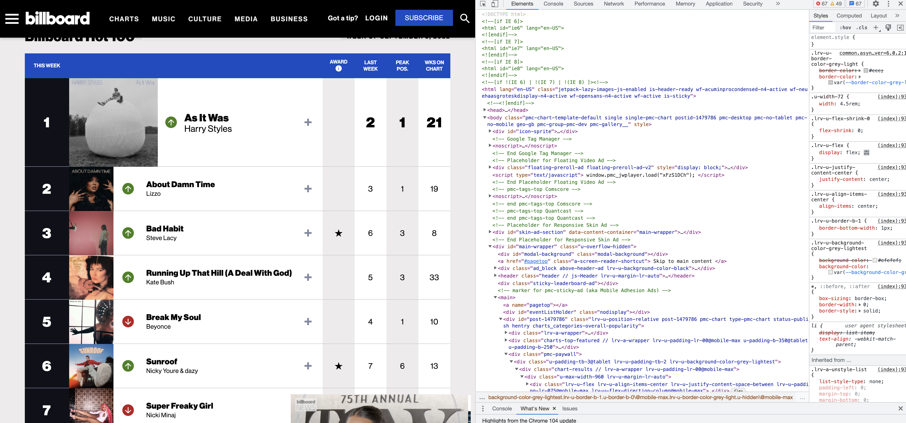

Scraping and Harvesting Web Data in R
================
Created by Keith McNulty on 26th July 2019

  - [Web Page Structure and Format](#web-page-structure-and-format)
      - [`HTML` code](#html-code)
      - [`XML` code](#xml-code)
      - [Using Google Chrome Developer](#using-google-chrome-developer)
      - [Embedded structure of web
        code](#embedded-structure-of-web-code)
      - [The `rvest` and `xml2` packages](#the-rvest-and-xml2-packages)
  - [Basic harvesting: The Billboard Hot 100
    page](#basic-harvesting-the-billboard-hot-100-page)
      - [Getting started](#getting-started)
      - [Forensically targeting information of
        interest](#forensically-targeting-information-of-interest)
  - [Making scraping easy by automating
    tasks](#making-scraping-easy-by-automating-tasks)
      - [Example: Writing a function to grab any Billboard chart from
        history](#example-writing-a-function-to-grab-any-billboard-chart-from-history)
      - [Example: Writing a function to grab any set of Eurovision Song
        Contest
        results](#example-writing-a-function-to-grab-any-set-of-eurovision-song-contest-results)
      - [Example: Packaging `wikifacts`](#example-packaging-wikifacts)

# Web Page Structure and Format

Any webpage you visit has a particular, expected general structure. It
usually consists of two types of code.

  - `HTML` code, which focuses on the appearance and format of a web
    page.
  - `XML` code, which doesn’t *look* a lot different from `HTML` but
    focuses more on managing data in a web page.

## `HTML` code

`HTML` code has an expected format and structure, to make it easy for
people to develop web pages. Here is an example of a simple `HTML` page:

    <!DOCTYPE html>
    <html>
    <head>
    <title>Page Title</title>
    </head>
    <body>
    
    <h1>This is a Heading</h1>
    <p>This is a paragraph.</p>
    
    </body>
    </html>

As you can see, the content is wrapped in tags like `<head></head>`,
`<body></body>`, `<p></p>`. These tags are pre-defined by the language
(you can only use the tags that `HTML` allows). Because `HTML` has a
more predictable structure, it is often easier to work with it and mine
it.

## `XML` code

`XML` format and structure is less predictable. Although it looks very
similar to `HTML`, users can create their own named tags. Here is an
example:

    <note>
      <to>Keith</to>
      <from>Steve</from>
      <heading>Kudos</heading>
      <body>Awesome work, dude!</body>
    </note>

Tags like `<to></to>` and `<from></from>` are completely made up by me.
The fact that tags are not pre-defined makes `XML` a little harder to
mine and analyze. But it’s hard to get at some of the data on the web
without using `XML`.

## Using Google Chrome Developer

To mine web data, it’s important that you can see the underlying code
and understand how it relates to what you are seeing on the page. The
best way to do this (in my opinion) is to use the Developer Tools that
come with Google Chrome.

When you are viewing a web page in Chrome, simply used `Ctrl+Shift+C` in
Windows or `Cmd+Option+C` on a Mac to open up the Elements console where
you can see all the code underlying the page. This can look really
complex, but don’t worry. Here’s a photo of Google Chrome Developer open
on the [Billboard Hot 100
page](https://www.billboard.com/charts/hot-100):

<center>



</center>

## Embedded structure of web code

If you play around with the code in the Developer you will see that it
has an embedded structure.

  - At the highest level there is a `<html>` tag.  
  - At the second level there are `<head>` and `<body>` tags.
  - Inside the `<body>` of the page, different elements are often
    separated by `<div>` tags.
  - Many different types of tags continue to be embedded down to many
    nested levels

This is important because it means we can mine elements of a web page
and treat them like lists in R. We often call a specific element of the
page a *node*. So if we want to mine a specific node, we can capture its
sub-nodes in a list. By doing so, this gives us the opportunity to apply
the tidyverse when mining web pages. The process of mining data from the
web is called *scraping* or *harvesting*.

## The `rvest` and `xml2` packages

The `rvest` and `xml2` packages were designed to make it easier for
people working in R to harvest web data. Since `xml2` is a required
package for `rvest` and the idea is that both packages work together,
you only need to install `rvest`. First, let’s ensure the packages we
need are installed and loaded:

``` r
if (!("rvest" %in% installed.packages())) {
  install.packages("rvest")
}

if (!("dplyr" %in% installed.packages())) {
  install.packages("dplyr")
}

library(rvest)
```

    ## Loading required package: xml2

``` r
library(dplyr)
```

    ## 
    ## Attaching package: 'dplyr'

    ## The following objects are masked from 'package:stats':
    ## 
    ##     filter, lag

    ## The following objects are masked from 'package:base':
    ## 
    ##     intersect, setdiff, setequal, union

`rvest` and `xml2` contain functions that allow us to read the code of a
web page, break it into a neat structure, and work with the pipe command
to efficiently find and extract specific pieces of information. Think of
it a bit like performing keyhole surgery on a webpage. Once you
understand what functions are available and what they do, it makes basic
web scraping very easy and can produce really powerful functionality.

# Basic harvesting: The Billboard Hot 100 page

We are going to use the example of mining the Billboard Hot 100 page at
<https://www.billboard.com/charts/hot-100>. If you view this page, it’s
pretty bling. There are videos popping up, images all over the place.
But the basic point of the page is to show the current Hot 100 chart.

So let’s set ourselves the task of just harvesting the basic info from
this page: Rank, Artist, Song Title for the Hot 100.

## Getting started

First we load our packages and then we use the function `read_html()` to
capture the HTML code of the Billboard Hot 100 page.

``` r
hot100page <- "https://www.billboard.com/charts/hot-100"
hot100 <- read_html(hot100page)

hot100
```

    ## {html_document}
    ## <html class="" lang="">
    ## [1] <head>\n<meta http-equiv="Content-Type" content="text/html; charset=UTF-8 ...
    ## [2] <body class="chart-page chart-page-" data-trackcategory="Charts-TheHot100 ...

``` r
str(hot100)
```

    ## List of 2
    ##  $ node:<externalptr> 
    ##  $ doc :<externalptr> 
    ##  - attr(*, "class")= chr [1:2] "xml_document" "xml_node"

The function has captured the entire content of the page in the form of
a special list-type document with two nodes `<head>` and `<body>`.
Almost always we are interested in the body of a web page. You can
select a node using `html_node()` and then see its *child nodes* using
`html_children()`.

``` r
body_nodes <- hot100 %>% 
  html_node("body") %>% 
  html_children()

body_nodes
```

    ## {xml_nodeset (37)}
    ##  [1] <div class="header-wrapper ">\n<header id="site-header" class="site-head ...
    ##  [2] <div class="site-header__placeholder"></div>
    ##  [3] <script>\n        var PGM = window.PGM || {};\n        PGM.config = PGM. ...
    ##  [4] <div class="chart-piano-overlay__attachment-point"></div>
    ##  [5] <main id="main" class="page-content"><div id="charts" data-page-title="T ...
    ##  [6] <div class="ad_desktop dfp-ad" data-position="promo" data-sizes="[[2,2]] ...
    ##  [7] <footer id="site-footer" class="site-footer"><div class="container foote ...
    ##  [8] <div class="biz-modal">\n    <div class="biz-modal__content">\n        < ...
    ##  [9] <script>\n    window.CLARITY = window.CLARITY || [];\n</script>
    ## [10] <div class="ad_clarity" data-out-of-page="true" style="display: none;">< ...
    ## [11] <script>\n    var darkMatterCMD = function() {\n        this.darkMatterC ...
    ## [12] <script>\n    CLARITY.push({\n        use: ['ads'],\n        run: functi ...
    ## [13] <script src="https://assets.billboard.com/assets/1580164465/js/external_ ...
    ## [14] <script src="https://assets.billboard.com/assets/1580164465/js/vendors_/ ...
    ## [15] <script src="https://assets.billboard.com/assets/1580164465/js/vendors_/ ...
    ## [16] <script src="https://assets.billboard.com/assets/1580164465/js/vendors_/ ...
    ## [17] <script src="https://assets.billboard.com/assets/1580164465/js/vendors_/ ...
    ## [18] <script src="https://assets.billboard.com/assets/1580164465/js/vendors_/ ...
    ## [19] <script src="https://assets.billboard.com/assets/1580164465/js/vendors_/ ...
    ## [20] <script src="https://assets.billboard.com/assets/1580164465/js/vendors_/ ...
    ## ...

If we want, we can go one level deeper, to see the nodes inside the
nodes. In this way, we can just continue to pipe deeper into the code:

``` r
body_nodes %>% 
  html_children()
```

    ## {xml_nodeset (9)}
    ## [1] <header id="site-header" class="site-header " role="banner"><div class="s ...
    ## [2] <div class="header-wrapper__secondary-header">\n<nav class="site-header-l ...
    ## [3] <div id="charts" data-page-title="THE HOT 100" data-chart-code="HSI" data ...
    ## [4] <div class="ad-holder ad-holder--footer">\n        \n\n\n            \n   ...
    ## [5] <div class="container footer-content">\n\t\t<div class="cover-image">\n\t ...
    ## [6] <div class="container">\n\t\t<p class="copyright__paragraph">© 2020 Billb ...
    ## [7] <div class="container">\n\t\t<p class="station-identification">\n\t\t\tBi ...
    ## [8] <div class="container">\n\t\t\t\n\n\n            \n    <div class="ad_des ...
    ## [9] <div class="biz-modal__content">\n        <button class="biz-modal__close ...

## Forensically targeting information of interest

So we could mess around with the functions above for a long time, but
might find it hard to work out where exactly this chart data is. We can
use Chrome Developer to tell us where we can find the data in the code,
and then we can use `rvest` to harvest out the data.

If you run your mouse over the code in the Developer you will see that
the elements of the page that the code refers to are highlighted in the
browser. You can click to expand embedded nodes to get to more specific
parts of the page. You can watch the video I added to this repo to see
how I progressively drill down the code to find the precise nodes that
contain the details of each chart entry (note this video uses a previous
version of the site but you’ll get the idea).

What we see is that each chart entry appears to be in `<span>` tag with
the class names `chart-element__rank__number`,
`chart-element__information__artist` and
`chart-element__information__song`.


Now we can use the function `xml_find_all()` to find all `<span>` nodes
in the body of the document that have a class name containing the class
names we want. `xml_find_all()` accepts `xpath` syntax. You can learn
more about `xpath` syntax
[here](https://www.w3schools.com/xml/xpath_syntax.asp). Once those
precise nodes are located, we can use the `rvest` function `html_text()`
to simply extract the info we want:

``` r
rank <- hot100 %>% 
  rvest::html_nodes('body') %>% 
  xml2::xml_find_all("//span[contains(@class, 'chart-element__rank__number')]") %>% 
  rvest::html_text()

artist <- hot100 %>% 
  rvest::html_nodes('body') %>% 
  xml2::xml_find_all("//span[contains(@class, 'chart-element__information__artist')]") %>% 
  rvest::html_text()

title <- hot100 %>% 
  rvest::html_nodes('body') %>% 
  xml2::xml_find_all("//span[contains(@class, 'chart-element__information__song')]") %>% 
  rvest::html_text()
```

That’s the Billboard Hot 100\! Nice\! Now we can combine them all into a
neat dataframe.

``` r
chart_df <- data.frame(rank, artist, title)

knitr::kable(
  chart_df  %>% head(10)
)
```

| rank | artist                     | title               |
| :--- | :------------------------- | :------------------ |
| 1    | Roddy Ricch                | The Box             |
| 2    | Future Featuring Drake     | Life Is Good        |
| 3    | Post Malone                | Circles             |
| 4    | Maroon 5                   | Memories            |
| 5    | Tones And I                | Dance Monkey        |
| 6    | Dua Lipa                   | Don’t Start Now     |
| 7    | Arizona Zervas             | Roxanne             |
| 8    | Lewis Capaldi              | Someone You Loved   |
| 9    | Dan + Shay & Justin Bieber | 10,000 Hours        |
| 10   | Billie Eilish              | everything i wanted |

# Making scraping easy by automating tasks

Generally we don’t just scrape a single webpage for fun. We are usually
scraping because there is information that we need on a large scale or
on a regular basis. Therefore, once you have worked out how to scrape
this information, you’ll need to set things up in a way that it is easy
to obtain it in the future. Writing functions is often a good way of
doing this.

## Example: Writing a function to grab any Billboard chart from history

If you take a look around the billboard site, you’ll see that you can
basically look up any chart at any date in history by simply inserting
the chart name and date at the appropriate point in the URL. For
example, to see the Billboard 200 on 21st July 1972 you would navigate
to <https://www.billboard.com/charts/billboard-200/1972-07-21>.

Since this will always produce a webpage in exactly the same structure
as the one we just scraped, we can now create quite a powerful function
that accepts a chart name, date and set of ranks, and returns the
entries for that chart on that date in those ranks.

``` r
#' Get billboard chart entries from history
#'
#' @param date date in the form YYYY-MM-DD
#' @param positions numeric vector
#' @param type character string of chart type (as per billboard.com URLs)
#' @return a dataframe of rank, artist, title
#' @examples get_chart(date = "1972-11-02", positions = c(1:100), type = "billboard-200")


get_chart <- function(date = Sys.Date(), positions = c(1:10), type = "hot-100") {

  # get url from input and read html
  input <- paste0("https://www.billboard.com/charts/", type, "/", date) 
  chart_page <- xml2::read_html(input)

  
  # scrape data
  rank <- chart_page %>% 
    rvest::html_nodes('body') %>% 
    xml2::xml_find_all("//span[contains(@class, 'chart-element__rank__number')]") %>% 
    rvest::html_text()
  
  artist <- chart_page %>% 
    rvest::html_nodes('body') %>% 
    xml2::xml_find_all("//span[contains(@class, 'chart-element__information__artist')]") %>% 
    rvest::html_text()
  
  title <- chart_page %>% 
    rvest::html_nodes('body') %>% 
    xml2::xml_find_all("//span[contains(@class, 'chart-element__information__song')]") %>% 
    rvest::html_text()

  # create dataframe, remove nas and return result
  chart_df <- data.frame(rank, artist, title)
  chart_df <- chart_df %>% 
    dplyr::filter(!is.na(rank), rank %in% positions)

chart_df

}
```

Now let’s test our function by looking up the Top 10 singles from 20th
January 1975:

``` r
test1 <- get_chart(date = "1975-01-20", positions = 1:10, type = "hot-100")

knitr::kable(test1)
```

| rank | artist                     | title                        |
| :--- | :------------------------- | :--------------------------- |
| 1    | Carpenters                 | Please Mr. Postman           |
| 2    | Neil Sedaka                | Laughter In The Rain         |
| 3    | Barry Manilow              | Mandy                        |
| 4    | Ohio Players               | Fire                         |
| 5    | Stevie Wonder              | Boogie On Reggae Woman       |
| 6    | Linda Ronstadt             | You’re No Good               |
| 7    | Paul Anka with Odia Coates | One Man Woman/One Woman Man  |
| 8    | Donny & Marie Osmond       | Morning Side Of The Mountain |
| 9    | Gloria Gaynor              | Never Can Say Goodbye        |
| 10   | AWB                        | Pick Up The Pieces           |

## Example: Writing a function to grab any set of Eurovision Song Contest results

Similarly, we can create a function `get_eurovision()` to scrape the
results of any [Eurovision Song
Contest](https://en.wikipedia.org/wiki/Eurovision_Song_Contest) since
1957. I will source this function from inside this repo and then grab
the 1974 contest results:

``` r
source("eurovision_scraping.R")

eurovision_1974 <- get_eurovision(1974)

knitr::kable(eurovision_1974)
```

| Country        | Artist                                 | Song                                                               | Language\[9\]  | Place | Points |
| :------------- | :------------------------------------- | :----------------------------------------------------------------- | :------------- | ----: | -----: |
| Sweden         | ABBA                                   | “Waterloo”                                                         | English        |     1 |     24 |
| Italy          | Gigliola Cinquetti                     | “Sì”                                                               | Italian        |     2 |     18 |
| Netherlands    | Mouth & MacNeal                        | “I See a Star”                                                     | English        |     3 |     15 |
| United Kingdom | Olivia Newton-John                     | “Long Live Love”                                                   | English        |     4 |     14 |
| Luxembourg     | Ireen Sheer                            | “Bye Bye I Love You”                                               | Frencha        |     4 |     14 |
| Monaco         | Romuald                                | “Celui qui reste et celui qui s’en va”                             | French         |     4 |     14 |
| Israel         | Kaveret                                | “Natati La Khayay” (נתתי לה חיי)                                   | Hebrew         |     7 |     11 |
| Ireland        | Tina Reynolds                          | “Cross Your Heart”                                                 | English        |     7 |     11 |
| Spain          | Peret                                  | “Canta y sé feliz”                                                 | Spanish        |     9 |     10 |
| Belgium        | Jacques Hustin                         | “Fleur de liberté”                                                 | French         |     9 |     10 |
| Greece         | Marinella                              | “Krasi, thalassa ke t’ agori mou”(Κρασί, θάλασσα και τ’ αγόρι μου) | Greek          |    11 |      7 |
| Yugoslavia     | Korni Grupa                            | “Generacija ’42” (Генерација ’42)                                  | Serbo-Croatian |    12 |      6 |
| Finland        | Carita                                 | “Keep Me Warm”                                                     | English        |    13 |      4 |
| Norway         | Anne-Karine Strøm feat. Bendik Singers | “The First Day of Love”                                            | English        |    14 |      3 |
| Germany        | Cindy & Bert                           | “Die Sommermelodie”                                                | German         |    14 |      3 |
| Switzerland    | Piera Martell                          | “Mein Ruf nach dir”                                                | German         |    14 |      3 |
| Portugal       | Paulo de Carvalho                      | “E depois do adeus”                                                | Portuguese     |    14 |      3 |

## Example: Packaging `wikifacts`

Recently I thought it might be useful to have a package that generated
random facts for people. This could be helpful for scripts or apps that
take a long time to execute, where you could occasionally display random
facts to keep people interested.

The Wikipedia Main Page has three predictable sections which can be
reliably scraped. So I used them to create three functions:

  - `wiki_didyouknow()` which takes random facts from the ‘Did you
    know…’ section
  - `wiki_onthisday()` which takes random facts from the ‘On this day…’
    section
  - `wiki_inthenews()` which takes random facts from the ‘In the news…’
    section

A fourth function `wiki_randomfact()` executes one of the above three
functions at random.

I packaged this into a package called `wikifacts` which can be installed
from github. Here’s some examples of the functions at work:

``` r
library(devtools)
```

    ## Loading required package: usethis

``` r
devtools::install_github("keithmcnulty/wikifacts")
```

    ## Skipping install of 'wikifacts' from a github remote, the SHA1 (f7e7f232) has not changed since last install.
    ##   Use `force = TRUE` to force installation

``` r
library(wikifacts)

wiki_didyouknow()
```

    ## Did you know that depictions of urinating boys (example pictured) in Renaissance art could alternately represent boyish innocence or erotic virility? (Courtesy of Wikipedia)

``` r
wiki_onthisday()
```

    ## Did you know that on this day in 1816 – Italian composer Gioachino Rossini's opera buffa The Barber of Seville premiered at the Teatro Argentina in Rome to jeers from the audience. (Courtesy of Wikipedia)
